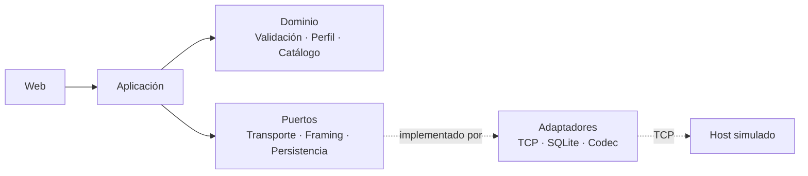

# El problema

- Simulador de VISA **rígido**
- Tiempo de prueba **variable** (segundos a horas)
- **Sin** capacidad de prueba de carga real

<!--
(0:50)
Hoy, para probar una transacción de pago, dependo de un simulador de VISA rígido.
Una transacción suelta se valida casi de inmediato, pero el mayor esfuerzo operativo
tiende a concentrarse en regresiones, certificaciones y coordinación entre personas.
Y hay algo que ese simulador no permite: probar carga real contra el switch.

Transición: "De ahí sale la oportunidad."
-->

---

# La oportunidad

- Tiempo de prueba: *"10 seg. a horas"* — **ESTIMADO** (`PROYECTO.md`)
- Casos reales de incidentes — **evidencia cualitativa**, sin cifra
- **Sin ROI inventado**

<!--
(0:50)
Ese rango de 10 segundos a horas está documentado como estimación, no medición,
y lo mantengo así. Existen casos reales donde una prueba inadecuada terminó en
un incidente — sin cifra de impacto, no la voy a inventar. No presento un ROI
en dinero: me faltan los datos reales para sostenerlo.

Transición: "Con eso en mente, esto es lo que construí."
-->

---

# Qué construí

**0100 → TCP → host simulado propio → 0110 → validación → persistencia/historial**

No implementado hoy: motor de carga · perfiles reales de marca · DE35/DE45 · autenticación

<!--
(0:50)
Construí el recorrido completo de una compra, de extremo a extremo, contra un
host simulado propio, con persistencia real y las cuatro reglas de negocio del
enunciado. Y para ser igual de claro con lo que falta: motor de carga, perfiles
reales de marca, transmisión real de Track 1/2, y autenticación — ninguna de
esas cuatro está resuelta hoy.

Transición: "Detrás de esto hay decisiones de arquitectura concretas."
-->

---

# Arquitectura

**RN-3 antes que RN-1** · perfil ≠ catálogo · el transporte no conoce ISO 8583

<!--
(1:20)
Las dependencias van en un solo sentido: web, aplicación, dominio, adaptadores.
Separé el perfil de marca del catálogo de respuestas, porque son dos decisiones
distintas. El transporte no conoce ISO 8583: el enmarcado es un contrato aparte.
Y algo puntual: al validar una respuesta, reviso primero que corresponda a mi
solicitud, y solo después miro si el código es de aprobación — si lo hiciera al
revés, tendría falsos positivos, y ese orden está en el código, no solo en el
diagrama.

Transición: "Prefiero mostrarlo antes que seguir describiéndolo. Esto es el
sistema corriendo de verdad, sin nada preparado detrás de cámara."
-->

---

# Demo en vivo

`http://127.0.0.1:8000/`

<!--
(3:00) GUION EXACTO DE LA DEMO — navegador ya abierto, demo.cmd corrido antes.
Tarjeta a usar: DEMO-0001. Destino: LOCAL-DEMO (127.0.0.1:8583).

0:00 — Pantalla "Nueva transacción". "Esto arma un mensaje 0100 y lo manda por
TCP a un host ISO 8583 simulado, que ya está corriendo en un proceso aparte."

0:15 — Señalar DEMO-0001 seleccionada, PAN enmascarado. "La interfaz nunca ve
el número completo de la tarjeta, solo esto."

0:30 — Señalar destino LOCAL-DEMO / 127.0.0.1:8583. "Este es el receptor
simulado."

0:45 — Clic en "Ejecutar transacción". "Esto dispara la compra real por el
socket TCP."

1:00 — Pantalla de resultado, estado APROBADA. "El mensaje viajó, volvió una
respuesta, y esto es el resultado ya interpretado."

1:15 — Isoscopio de solicitud y respuesta. "Todo el mensaje, campo por campo."

1:30 — Señalar PAN enmascarado, monto, STAN, campo 39. "El PAN sigue
enmascarado incluso en la vista técnica; el monto y el STAN coinciden entre
solicitud y respuesta; el campo 39 contiene el código de respuesta que luego
se interpreta contra el catálogo configurado."

1:50 — Clic en "Historial". "Cada intento queda registrado acá, identificado
por el id de la tarjeta, nunca por el número."

2:10 — Abrir el detalle de la ejecución recién creada (/historial/{id}). "Y
cada ejecución tiene su propio detalle persistido — no es una tabla resumen,
es la transacción completa consultable después."

2:30 — Ir a "Configuración" → "Tarjetas de prueba". "Esto no es una maqueta:
hay administración real de tarjetas — listar, crear, editar, activar o
desactivar." (Señalar de pasada que "Códigos de respuesta" y "Destinos" siguen
como "Próximamente", sin entrar.)

2:50 — Cerrar sin abrir alta/edición. "No voy a abrir el formulario de alta en
vivo, para no escribir un número de tarjeta en pantalla."

3:00 — Cierre. "Con esto en pantalla, vuelvo a la presentación."

NO MOSTRAR: Track 1/Track 2, motor de carga, formulario de alta/edición de
tarjetas, consola o código.

Transición: "Todo lo que acaban de ver funciona porque cada decisión
importante pasó por revisión antes de confirmarse — y hay un caso concreto
que lo demuestra."

PLAN B (60s, si la app falla) — screenshots pregrabados:
0:00-0:20 — "Nueva transacción" con DEMO-0001 y PAN enmascarado. "La interfaz
solo recibe el identificador de la tarjeta."
0:20-0:35 — Resultado con isoscopio abierto, ************6666 visible. "El
mensaje completo interpretado, tarjeta siempre enmascarada."
0:35-0:45 — Detalle de historial. "Cada ejecución queda persistida y
consultable."
0:45-0:60 — "Configuración → Tarjetas de prueba". "Hay administración real,
no una maqueta."
(Grabados antes de la clase; si la demo real falla a mitad de camino, saltar
directo al screenshot que corresponda, sin reiniciar demo.cmd en vivo.)
-->

---

# Supervisión de Claude Code

Afirmación del agente

→

Detección humana

→

Control establecido

→

Aplicación posterior

Claude aceleró el desarrollo. Ninguna afirmación externa se aceptó sin revisión.

<!--
(1:15)
Quiero ser específico, no solo decir que "revisé todo". Claude escribió que el
prefijo '9' de tarjetas sintéticas "no se asigna a marcas de pago" y que "no
puede coincidir con una tarjeta real". Sonaba razonable, porque Visa y
Mastercard efectivamente no lo usan — el error fue generalizar de ahí a que
ninguna tarjeta real lo usa, sin verificar que ISO/IEC 7812 reserva ese
prefijo para asignación nacional. Lo detecté yo, revisando el código antes del
commit, no una prueba automatizada. Y esto es clave: ninguna prueba podía
detectarlo, porque el código generaba números correctos — el problema no
estaba en lo que el programa hacía, estaba en por qué decía que lo hacía.
Reemplacé esa afirmación por algo verificable: esos números nunca pasan la
verificación de Luhn. El control que quedó —toda norma externa debe citarse o
declararse decisión propia— lo apliqué después, al incorporar documentación
real de Visa y Mastercard: solo registro que existe y su fecha, nunca afirmo
haber verificado su contenido.

Transición: "Esa misma disciplina es la que sostiene los resultados que puedo
mostrar con evidencia."
-->

---

# Resultados verificados

436

pruebas en verde

29

de RN-1 a RN-4

2

máquinas distintas

10

fechas de commit

<!--
(0:50)
436 pruebas en verde, 29 específicas de las cuatro reglas de negocio, corriendo
solas en cada push. Probé la reproducibilidad completa en una segunda
computadora, desde cero. Y el arranque está automatizado con un comando y un
skill que verifican por su cuenta que el sistema quedó disponible.

Transición: "Con esto funcionando, la pregunta es hacia dónde podría ir."
-->

---

# Adopción y riesgos

| QA interno | Piloto institucional futuro | Producto para terceros |
|---|---|---|
| Hoy, ya probado | Condicionado | Hipotético |

**Brechas actuales**
sin autenticación · sin cifrado en reposo · sin perfiles reales de marca
framing de demostración · sin PIN/llaves reales · sin validación regulatoria externa

<!--
(1:00)
El uso interno de QA es el escenario de hoy. Un piloto institucional es
futuro, y está condicionado a resolver antes autenticación y cifrado en
reposo. Un producto para terceros es todavía más lejano. En ningún punto
afirmo cumplimiento de PCI-DSS, ISO 27001 ni de ninguna marca.

Transición: "Eso me lleva al retorno."
-->

---

# Retorno y recomendación

Retorno en **horas**, no en dinero. Crece con casos, repeticiones y participantes.

Motor de carga: siguiente capacidad, hoy congelada.

Avanzar a un piloto interno controlado, no a producción inmediata.

<!--
(0:55)
No pongo una cifra en dinero ni un punto de equilibrio semanal: no tengo los
datos reales para sostenerlo. El retorno está en horas, y crece con el número
de casos, repeticiones y personas involucradas. La siguiente capacidad, hoy
congelada, es el motor de carga. Mi recomendación: este prototipo demuestra
valor suficiente para avanzar a un piloto interno controlado — no para
producción inmediata.
-->
